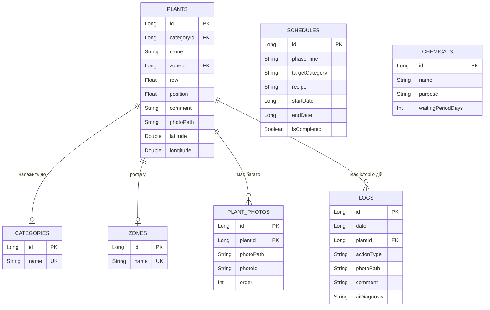

# Документація застосунку «Розумний Сад» (Fazenda App)

Застосунок **«Розумний Сад»** — це сучасний та зручний мобільний помічник для дачників, садівників та фермерів, який поєднує в собі функції каталогу рослин, планувальника догляду, інтерактивної карти ділянки та журналу подій з елементами інтеграції штучного інтелекту (ШІ) та прогнозу погоди.

Проєкт реалізовано на мові **Kotlin** з використанням сучасного стека розробки під Android: **Jetpack Compose** для інтерфейсу, **Room** для бази даних, **OsmDroid** для мап та **Coroutines/Flow** для асинхронної роботи.

---

## 📂 Структура проєкту

Проєкт має чітко розділену архітектуру (MVVM):

*   **`com.fazenda.app`** — головний пакет додатку.
    *   **`MainActivity.kt`** — єдина Activity застосунку, яка ініціалізує тему та систему навігації.
    *   **`FazendaApplication.kt`** — ініціалізує базу даних та репозиторії на рівні всього додатку.
*   **`data`** — рівень доступу до даних.
    *   **`database/AppDatabase.kt`** — база даних Room. Містить callback для автоматичного первинного наповнення (seeding) даними з CSV файлів при першому запуску.
    *   **`dao/`** — інтерфейси доступу до таблиць БД (`PlantDao`, `LogDao`, `ZoneDao` тощо).
    *   **`entity/`** — сутності Room:
        *   `PlantEntity` — рослина (назва, категорія, зона розташування, ряд, позиція, GPS координати, фото, коментар).
        *   `CategoryEntity` — категорія рослини (напр. Томати, Яблуні, Ягоди).
        *   `ZoneEntity` — зона на дачі (напр. Теплиця, Верхній сад, Город).
        *   `PlantPhotoEntity` — додаткові фотографії рослини для галереї.
        *   `LogEntity` — записи у журналі догляду (дата, тип дії, фото, коментар, ШІ-діагноз).
        *   `ScheduleEntity` — розклад обробок рослин (фаза, категорія, рецепт).
        *   `ChemicalEntity` — каталог добрив та засобів захисту рослин (назва, призначення, термін очікування).
    *   **`util/CsvParser.kt`** — утиліта для парсингу CSV файлів для первинної ініціалізації БД.
*   **`service`** — допоміжні сервіси додатку:
    *   `WeatherService` — отримання прогнозу погоди через API Open-Meteo та розрахунок агрономічних рекомендацій (чи сприятлива температура, чи очікуються опади).
    *   `PlantInfoService` — пошук інформації про рослини у Вікіпедії (Wikipedia API) з авто-корекцією мови пошуку (українська -> англійська).
    *   `BackupService` — створення резервних копій бази даних та фотографій у форматі ZIP, можливість поділитися файлом бекапу або імпортувати його назад.
    *   `LocationService` — робота з GPS координатами користувача.
    *   `UpdateService` — автоматична перевірка наявності оновлень застосунку через GitHub Releases та завантаження нового APK.
*   **`ui`** — рівень представлення (інтерфейс користувача):
    *   **`navigation/AppNavigation.kt`** — налаштування навігації Jetpack Compose (нижня панель навігації та детальні екрани).
    *   **`theme/Theme.kt`** — налаштування Material 3 теми.
    *   **`screen/`** — екрани додатку:
        *   `dashboard/` — головний екран «План дій» (план обробок, перевірка оновлень).
        *   `catalog/` — каталог рослин, деталі рослини (з галереєю та історією), додавання/редагування рослини, налаштування зон та категорій.
        *   `journal/` — журнал догляду, створення нового запису з можливістю зробити фото камерою або завантажити з галереї та додати рекомендації ШІ.
        *   `map/` — інтерактивна мапа OsmDroid з кастомними круглими пінами рослин на основі їх фотографій.

---

## 🛠 Реалізований функціонал

### 1. Екран «План дій» (Dashboard)
*   Показує список запланованих агро-обробок (рецептів) відповідно до фаз росту для різних категорій рослин.
*   Інтегровано механізм **UpdateService** — при запуску екран перевіряє GitHub на наявність нової версії APK та пропонує оновитись у спливаючому діалозі.
*   Швидкий перехід до створення запису у журналі, карти або налаштувань.

### 2. Каталог рослин
*   Відображення списку рослин з інформацією про категорію, зону розташування (сад, теплиця), ряд та номер на ділянці.
*   **Гнучкий пошук**: за назвою рослини, категорією, зоною або координатами посадки (ряд/номер).
*   **Фільтрація**: швидкий фільтр за категоріями через випадаюче меню.
*   **Детальний перегляд**:
    *   Головне фото рослини (з можливістю відкрити повноекранний переглядач).
    *   Горизонтальна галерея додаткових фото рослини (можна додати нове фото, видалити або призначити будь-яке фото головним через довге натискання).
    *   Карта розташування з GPS-координатами.
    *   Коментар та опис.
    *   Детальна історія дій саме для цієї рослини (інтегрована з загального журналу).
*   **Додавання та редагування**: створення нової картки рослини з фотографією, геокоординатами, зонами та категоріями.

### 3. Журнал дій
*   Хронологічний перелік усіх виконаних робіт на дачі.
*   Кожен запис має свій кольоровий тег та відповідний емодзі залежно від типу дії:
    *   📝 Примітка
    *   🌱 Підживлення
    *   💨 Обприскування
    *   🔄 Заміна
    *   ➕ Додано рослину (автоматично створюється при додаванні в каталог)
    *   🗑 Видалено рослину (автоматично створюється при видаленні)
*   **Створення запису**:
    *   Вибір дати за допомогою календаря (`DatePicker`).
    *   Вибір рослини з каталогу та типу дії.
    *   Можливість зробити фото прямо з додатку (вбудована камера через **CameraX**) або обрати з галереї.
    *   Поле для коментарів та **«Діагноз ШІ»** — кнопка для швидкого переходу до Gemini з полем для копіювання отриманої відповіді.

### 4. Інтерактивна мапа рослин
*   Побудована на базі бібліотеки **OsmDroid** (працює без сервісів Google).
*   Відображає реальне просторове розташування рослин на ділянці.
*   **Кастомні маркери**: замість звичайних пінів генеруються круглі мініатюри (аватари) рослин з білою рамкою.
*   При натисканні на маркер відкривається віконце з фото, назвою рослини та її зоною, а тап по віконцю переводить користувача на екран детальної інформації про рослину.
*   Можливість визначення геолокації користувача в реальному часі за допомогою кнопки GPS.

### 5. Керування даними та бекап (Settings)
*   Експорт всіх даних застосунку (БД SQLite + папка з фотографіями) в один стиснутий файл **ZIP**.
*   Можливість поділитися бекапом через месенджери, пошту чи зберегти безпосередньо у внутрішню пам'ять пристрою.
*   **Імпорт даних**: відновлення всієї бази даних та фотографій з файлу бекапу з автоматичним перезапуском додатку після завершення.
*   Керування списком категорій рослин та садовими зонами (додавання, зміна назв, видалення).

---

## 💾 Схема бази даних (Room)

Застосунок використовує локальну базу даних `fazenda_db` зі спрощеною структурою відношень:

